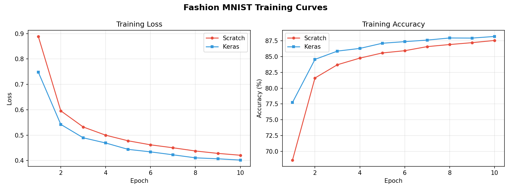
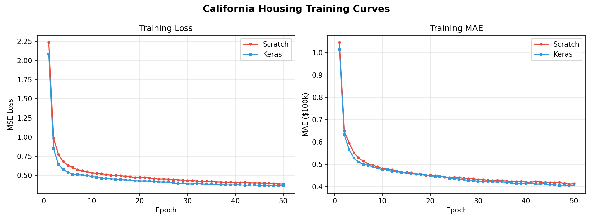
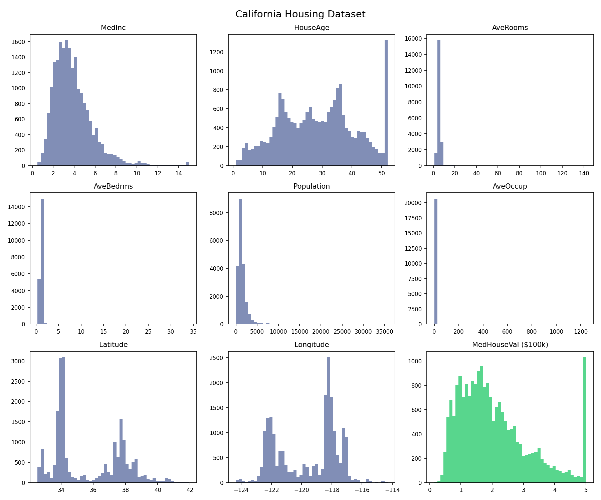

# Neural Network from Scratch

A fully connected neural network implemented from scratch using **only NumPy** — no PyTorch, no TensorFlow, no autograd. Every component (dense layers, activations, loss, dropout, regularization, optimizer) was hand-derived and implemented with raw math. Supports both **classification** and **regression**, trained on [Fashion MNIST](https://github.com/zalandoresearch/fashion-mnist) and [California Housing](https://scikit-learn.org/stable/datasets/real_world.html#california-housing-dataset), with Keras baselines for comparison.

## 📈 Results

### Fashion MNIST (Classification)

| | Training Accuracy | Test Accuracy | Test Loss |
|---|---|---|---|
| **From Scratch (NumPy)** | 87.5% | **87.0%** | **0.360** |
| Keras Baseline | 88.2% | 87.0% | 0.429 |



### California Housing (Regression)

| | Test MSE | Test MAE | Test R² |
|---|---|---|---|
| **From Scratch (NumPy)** | 0.417 | 0.448 | 0.690 |
| Keras Baseline | **0.351** | **0.388** | **0.758** |



## Dataset

### Fashion MNIST


10 classes of clothing items — T-shirts, trousers, pullovers, dresses, coats, sandals, shirts, sneakers, bags, and ankle boots. Each image is 28x28 grayscale, flattened to 784 inputs.

### California Housing



20,640 samples with 8 features — median income, house age, average rooms, average bedrooms, population, average occupancy, latitude, and longitude. Target is median house value in $100k units.

## Architecture

### Fashion MNIST (Classification)

| Layer | Units | Activation | Initialization | Regularization | Dropout |
|---|---|---|---|---|---|
| Input | 784 | — | — | — | — |
| Hidden 1 | 128 | ReLU | Random (0.01σ) | L2 (λ = 5e-4) | 0.1 |
| Hidden 2 | 64 | ReLU | Random (0.01σ) | L2 (λ = 5e-4) | 0.1 |
| Output | 10 | Softmax | — | — | — |

Loss: Categorical Cross-Entropy | Optimizer: Adam (lr=0.001, decay=1e-4) | Batch: 128 | Epochs: 10

### California Housing (Regression)

| Layer | Units | Activation | Initialization | Regularization | Dropout |
|---|---|---|---|---|---|
| Input | 8 | — | — | — | — |
| Hidden 1 | 64 | ReLU | Random (0.01σ) | L2 (λ = 5e-4) | 0.1 |
| Hidden 2 | 32 | ReLU | Random (0.01σ) | L2 (λ = 5e-4) | 0.1 |
| Output | 1 | Linear | — | — | — |

Loss: Mean Squared Error | Optimizer: Adam (lr=0.001, decay=1e-4) | Batch: 128 | Epochs: 50

## 📓 Step-by-Step Notebook

Want to see how I built every component from a single neuron to a full network? Check out the full learning journey on Google Colab:

[](https://colab.research.google.com/drive/1kSnJVdCw2EiyyYwZw_wInFC0fGU8BGWB?usp=sharing)

## 🧠 What's Implemented from Scratch

Every forward and backward pass derived from the math:

- **Dense Layer** — matrix multiply forward, transposed gradient backward, with L1/L2 regularization gradients
- **ReLU Activation** — element-wise forward, masked gradient backward
- **Softmax + Cross-Entropy Loss** — combined for numerical stability, with the Jacobian shortcut in backprop
- **Mean Squared Error Loss** — per-sample MSE forward, normalized gradient backward
- **Linear Activation** — identity pass-through for regression output
- **Dropout** — inverted dropout with scaled binary mask, gradient passthrough
- **Adam Optimizer** — momentum + RMSProp with bias correction on both moments

## 📂 Project Structure

```
nn/                              shared from-scratch library
  __init__.py                    public API
  layers.py                      dense layer, dropout
  activations.py                 relu, softmax, linear
  losses.py                      cross-entropy, MSE
  optimizers.py                  adam optimizer
fashion_mnist/                   classification task
  train_scratch.py               train with from-scratch implementation
  train_keras.py                 train with Keras (same arch)
  inference.py                   load model and predict programmatically
  demo.py                        interactive inference with confidence bars
  visualize_dataset.py           preview grid of dataset samples
  results/                       saved metrics + model weights
  assets/                        images and visualizations
california_housing/              regression task
  train_scratch.py               train with from-scratch implementation
  train_keras.py                 train with Keras (same arch)
  inference.py                   load model and predict house prices
  demo.py                        interactive scatter plot demo
  visualize_dataset.py           feature distribution histograms
  results/                       saved metrics + model weights
  assets/                        images and visualizations
```

## 🛠️ Dependencies

- Python 3.x
- NumPy
- TensorFlow (for loading Fashion MNIST)
- scikit-learn (for loading California Housing)
- Matplotlib (for visualization)

## 👨‍💻 How to Run

```bash
git clone https://github.com/abdullah2240/neural-network-from-scratch.git
cd neural-network-from-scratch
pip install -r requirements.txt

# Fashion MNIST (classification)
python fashion_mnist/train_scratch.py      # train and save weights
python fashion_mnist/train_keras.py        # keras baseline
python fashion_mnist/demo.py               # interactive confidence bars demo

# California Housing (regression)
python california_housing/train_scratch.py # train and save weights
python california_housing/train_keras.py   # keras baseline
python california_housing/demo.py          # interactive scatter plot demo
```

## License

MIT
